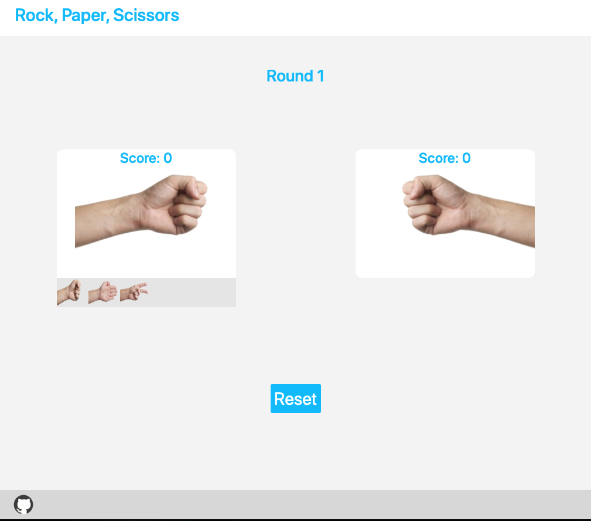

# Rock-Paper-Scissors
This webpage compromises of two opponents; the player and the computer.
At each round, the player will either draw, win, or lose, the game against the computer.
Scores get updated based on a round to round basis.
First opponent to get 5 points wins the game and the game will reset after.

